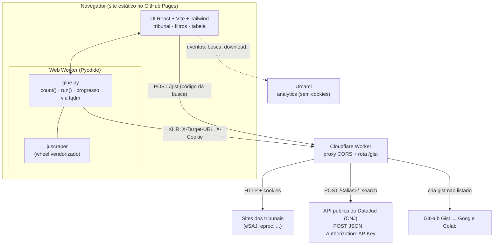
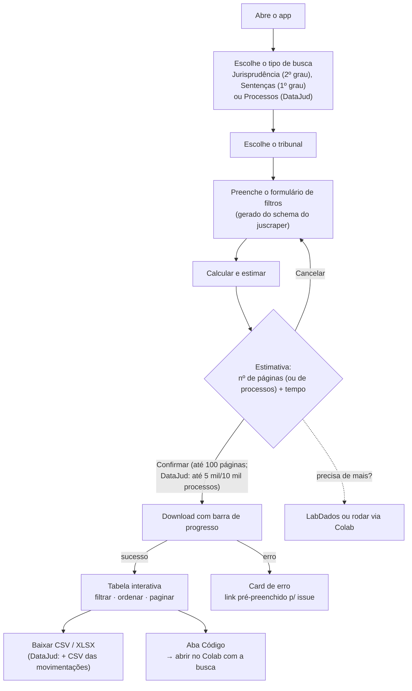
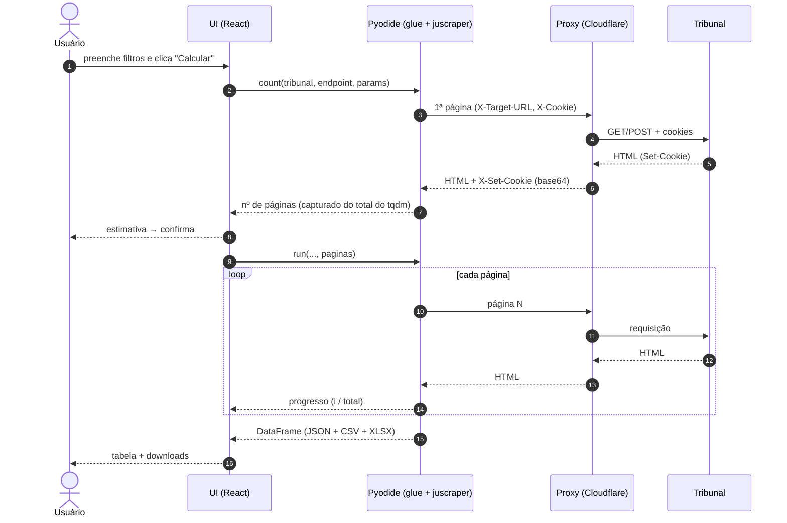

# juscraper-app

App web para baixar **jurisprudência** e **listas de processos** dos tribunais
brasileiros de forma interativa, rodando o [`juscraper`](https://github.com/jtrecenti/juscraper)
**direto no navegador** (via Pyodide). Página estática, sem backend próprio:
apenas um proxy CORS mínimo para contornar a same-origin policy.

A pessoa escolhe o tipo de busca (**Jurisprudência / 2º grau** = `cjsg`,
**Banco de Sentenças / 1º grau** = `cjpg`, ou **Processos (DataJud)** =
`datajud.listar_processos`) e o tribunal; o formulário de filtros
é gerado automaticamente a partir do schema da função do `juscraper`. A
ferramenta calcula o número de páginas, estima o tempo, pede confirmação, roda
com barra de progresso e mostra uma tabela interativa com download em CSV. Em
caso de erro, gera um link pré-preenchido para abrir issue no `juscraper`.

A aba **Processos (DataJud)** lista processos pela **data de ajuizamento** a
partir da [API pública do DataJud](https://datajud-wiki.cnj.jus.br/api-publica/)
(CNJ), inclusive os que ainda não têm decisão. Isso permite desenhos de pesquisa
**prospectivos** (ex.: "todos os processos de usucapião distribuídos no TJSP em
2022, e suas movimentações"), enquanto `cjsg`/`cjpg` só alcançam casos já
decididos.

> ⚠️ **A busca é feita ao vivo.** Não há base pré-baixada: cada consulta acessa
> o site do tribunal (ou a API do CNJ) na hora. Os dados são processados no seu
> navegador.

## Arquitetura



Por que o proxy: o navegador bloqueia requisições diretas aos tribunais e à API
do DataJud (eles não mandam cabeçalhos CORS). O proxy só repassa o HTTP (método,
corpo e cabeçalhos, inclusive `Authorization`) e devolve a resposta com
`Access-Control-Allow-Origin`. Ver [`proxy/README.md`](proxy/README.md).

## Como funciona

### Jornada do usuário



### O que acontece numa busca



Na aba DataJud o fluxo é o mesmo, com duas diferenças: a estimativa vem de
`contar_processos` (uma consulta `size=0` que devolve o total exato) e o
download usa `listar_processos` com páginas de 1.000 processos (500 com
movimentações). O glue achata os campos aninhados do CNJ (camelCase) numa
tabela legível: número CNJ formatado, tribunal, grau, classe (código e nome),
assuntos, órgão julgador, data de ajuizamento e, com movimentações, a
quantidade e as datas da primeira e da última. As movimentações também saem
num segundo CSV em formato longo (uma linha por movimentação:
`numero_processo`, `grau`, `data_hora`, `codigo`, `nome`, `complementos`), para
calcular durações (ex.: do ajuizamento até a sentença). As datas do CNJ, que
vêm em dois formatos (ISO e `AAAAMMDDhhmmss`), saem normalizadas como
`AAAA-MM-DD hh:mm:ss`.

### Suporte por tribunal
- **cjsg**: todos os 25 TJs.
- **cjpg**: TJES, TJSP, TJTO.
- **Processos (DataJud)**: todos os índices da API pública mapeados no
  `juscraper` (TJs, TRFs, TRTs, TREs, justiça militar, STJ, TST, TSE, STM...).
- **Experimental**: TJCE (TLS customizado pode falhar pelo proxy).
- **Indisponível no v1**: TJMG (exige resolver captcha de imagem).

## Estrutura

| Caminho | O quê |
|---------|-------|
| `web/` | App React/Vite/Tailwind (UI + bridge Pyodide) |
| `web/src/pyodide/glue.py` | Glue Python: install, roteamento de rede, count/run, achatamento do DataJud |
| `web/src/data/courts_meta.json` | Metadados gerados (campos por tribunal + seção `datajud`) |
| `web/public/wheels/` | Wheel do juscraper vendorizado (versionado) |
| `web/public/trees/` | Árvores de classes/assuntos (eSAJ e TPU do CNJ); **não versionado**, baixado da release no deploy |
| `proxy/` | Cloudflare Worker (proxy CORS) |
| `scripts/gen_courts_meta.py` | Gera `courts_meta.json` a partir dos schemas |
| `scripts/gen_trees.py` | Gera as árvores em `web/public/trees/` (publicadas na release `trees`) |
| `scripts/spike_proxy.py` | Teste headless do fluxo proxy + juscraper |

## Desenvolvimento

Pré-requisitos: Node 18+, Python 3.12 com o `juscraper` instalado (use o
`.venv` do repo), e a CLI `wrangler` (via `npx`).

```bash
# 1. Proxy local
cd proxy && npx wrangler dev --port 8787 --local

# 2. Web (em outro terminal)
cd web
cp .env.example .env        # VITE_PROXY_URL=http://localhost:8787
npm install
npm run dev                 # http://localhost:5173
```

### Atualização do juscraper

O app instala um **wheel vendorizado** em `web/public/wheels/`, e descobre qual
carregar em runtime via `web/public/wheels/manifest.json` (`{wheel, version, rev}`).
Nada de versão fica hardcoded no código.

Isso é atualizado automaticamente pela Action
[`update-juscraper.yml`](.github/workflows/update-juscraper.yml), que roda todo
dia às 03:00 (Brasília): rebuilda o wheel a partir do `main` do
[juscraper](https://github.com/jtrecenti/juscraper), regenera o `courts_meta.json`
e, se algo mudou (comparando a SHA do commit), commita e dispara o deploy. Se o
build do wheel ou a geração de metadados falhar, o job aborta e a versão anterior
continua no ar.

Para atualizar **manualmente** (ou regenerar os metadados localmente):
```bash
.venv/Scripts/python.exe scripts/gen_courts_meta.py   # regenera courts_meta.json
# e, se trocar o wheel, atualize web/public/wheels/ + manifest.json
```
Ou dispare a Action na mão: **Actions > Atualizar juscraper (diário) > Run workflow**.

> Use o Python do `.venv` direto (ou `uv run --no-sync`). O `uv run` comum
> ressincroniza o ambiente pelo `uv.lock` e troca o wheel vendorizado pelo
> `juscraper` do PyPI, o que gera metadados diferentes dos do app.

### Seletor de classes/assuntos (árvores eSAJ e TPU)

Os campos `classe`, `assunto`, `orgao_julgador` (cjsg) e `vara` (cjpg) dos
tribunais da família eSAJ usam um seletor visual em árvore, alimentado por JSON
em `<sigla>.<endpoint>.<campo>.json`. Esses arquivos são gerados pelos métodos
`listar_*` do juscraper (a partir dos endpoints `*TreeSelect.do`).

Na aba DataJud, `classe`, `assunto` e `movimentos_codigo` usam as tabelas da
**TPU (Tabela Processual Unificada) do CNJ**, as mesmas codificações que o
DataJud usa. Elas vêm da API pública da TPU
(`gateway.cloud.pje.jus.br/tpu/api/v1/publico/download/{classes,assuntos,movimentos}`)
e viram `tpu.classes.json`, `tpu.assuntos.json` e `tpu.movimentos.json` (~1 MB no
total). O código TPU aparece junto do nome (ex.: "Usucapião (49)") e dá para
buscar por nome ou por código; itens inativos continuam na lista, sinalizados,
porque processos antigos ainda os usam.

Tudo é gerado por:
```bash
.venv/Scripts/python.exe scripts/gen_trees.py              # eSAJ + TPU (local)
.venv/Scripts/python.exe scripts/gen_trees.py --tpu-only   # só a TPU (rápido)
```
Para **não pesar o versionamento** (somam ~12 MB), as árvores ficam na release
[`trees`](https://github.com/lab-dados/juscraper-app/releases/tag/trees) do repo,
e **não** são commitadas (`web/public/trees/` está no `.gitignore`). O
[`deploy.yml`](.github/workflows/deploy.yml) baixa os assets dessa release antes do
build, então o GitHub Pages serve as árvores na mesma origem (sem CORS). O app cai
no input manual de IDs (ou de códigos TPU) se uma árvore não estiver disponível.

As árvores mudam devagar, então a Action **não** as regenera no run diário: só no
cron mensal (dia 1) ou quando disparada com `regen_trees=true`. Nesses casos ela
roda `gen_trees.py`, sobe os JSON para a release (`gh release upload trees ... --clobber`)
e dispara o deploy. O `gen_trees.py` vira no-op para o eSAJ se o juscraper
instalado não tiver os métodos `listar_*`, e segue sem a TPU se a API da TPU
estiver fora do ar.

## Deploy

1. **Proxy** (Cloudflare Workers, free): `cd proxy && npx wrangler deploy`.
   Copie a URL para `web/.env` (`VITE_PROXY_URL`).
2. **Site** (GitHub Pages): `cd web && npm run build` gera `web/dist/`.
   Há um workflow em [`.github/workflows/deploy.yml`](.github/workflows/deploy.yml)
   que faz build e publica no Pages a cada push na `main`.

## Notas técnicas
- micropip 0.27.x falha ao baixar wheels por URL; por isso o wheel é buscado em
  JS e instalado via esquema `emfs:` (ver `web/src/pyodide/worker.ts`).
- O proxy segue redirects manualmente, acumulando cookies, para imitar o
  `requests.Session`. Cookies viajam como `X-Cookie`/`X-Set-Cookie` (base64)
  porque `Cookie`/`Set-Cookie` são *forbidden headers* no navegador.
- O total de páginas é capturado pelo argumento `total` do `tqdm` que o
  juscraper cria internamente; quando o tribunal não o expõe, a UI pede um
  limite de páginas.
- DataJud: a API exige `Authorization: APIKey <chave pública do CNJ>` (a chave
  é pública e vem no próprio `juscraper`). Pela especificação do Fetch, o
  curinga `*` em `Access-Control-Allow-Headers` não cobre `Authorization`, por
  isso o proxy lista esse cabeçalho explicitamente.
- DataJud: o mesmo número CNJ pode aparecer em mais de uma linha quando o
  tribunal envia um documento por grau (G1, G2, JE...). As colunas `grau` e
  `id_datajud` distinguem os documentos.
