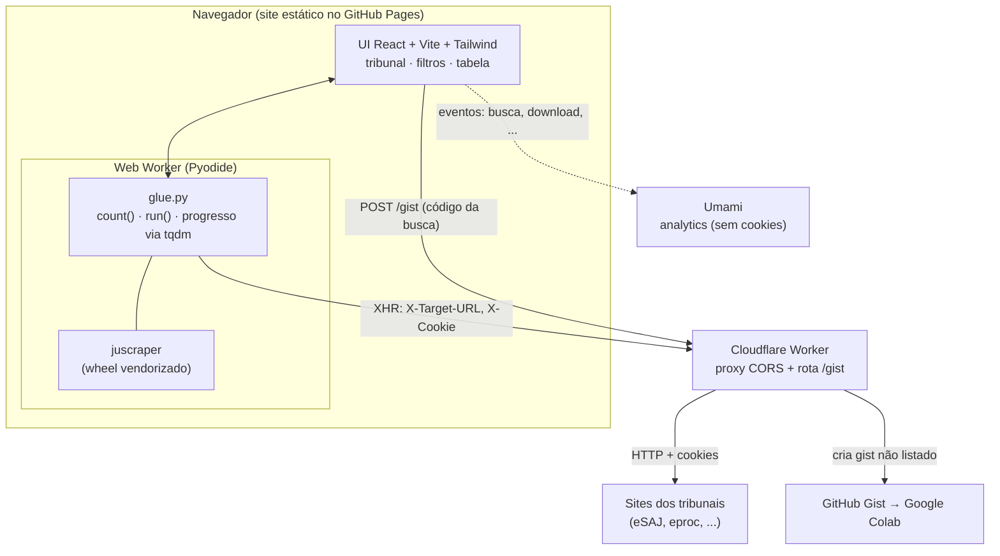
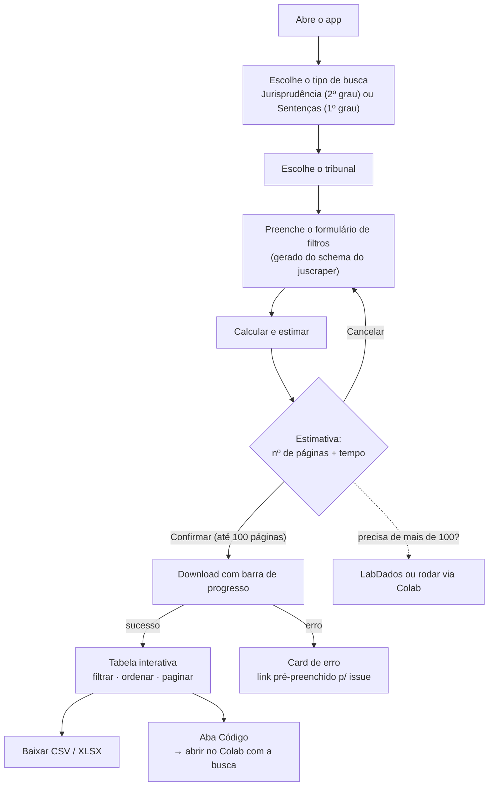
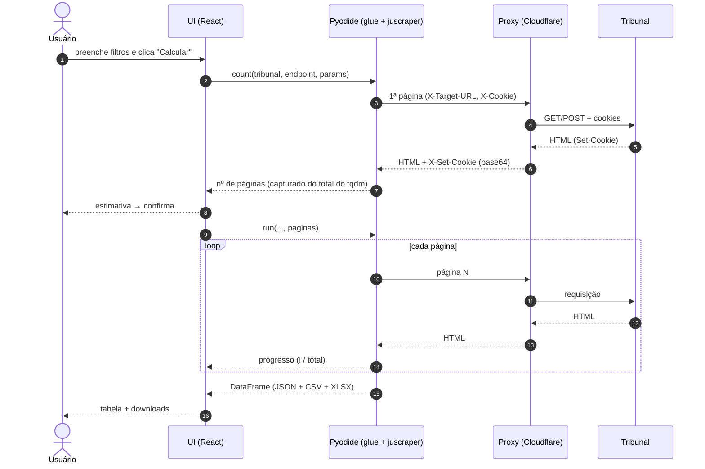

# juscraper-app

App web para baixar **jurisprudência** dos tribunais brasileiros de forma
interativa, rodando o [`juscraper`](https://github.com/jtrecenti/juscraper)
**direto no navegador** (via Pyodide). Página estática, sem backend próprio —
apenas um proxy CORS mínimo para contornar a same-origin policy.

A pessoa escolhe o tipo de busca (**Jurisprudência / 2º grau** = `cjsg`, ou
**Banco de Sentenças / 1º grau** = `cjpg`) e o tribunal; o formulário de filtros
é gerado automaticamente a partir do schema da função do `juscraper`. A
ferramenta calcula o número de páginas, estima o tempo, pede confirmação, roda
com barra de progresso e mostra uma tabela interativa com download em CSV. Em
caso de erro, gera um link pré-preenchido para abrir issue no `juscraper`.

> ⚠️ **A busca é feita ao vivo.** Não há base pré-baixada — cada consulta acessa
> o site do tribunal na hora. Os dados são processados no seu navegador.

## Arquitetura



Por que o proxy: o navegador bloqueia requisições diretas aos tribunais (eles
não mandam cabeçalhos CORS). O proxy só repassa o HTTP e devolve a resposta com
`Access-Control-Allow-Origin`. Ver [`proxy/README.md`](proxy/README.md).

## Como funciona

### Jornada do usuário



### O que acontece numa busca



### Suporte por tribunal
- **cjsg**: todos os 25 TJs.
- **cjpg**: TJES, TJSP, TJTO.
- **Experimental**: TJCE (TLS customizado pode falhar pelo proxy).
- **Indisponível no v1**: TJMG (exige resolver captcha de imagem).

## Estrutura

| Caminho | O quê |
|---------|-------|
| `web/` | App React/Vite/Tailwind (UI + bridge Pyodide) |
| `web/src/pyodide/glue.py` | Glue Python: install, roteamento de rede, count/run |
| `web/src/data/courts_meta.json` | Metadados gerados (campos por tribunal) |
| `web/public/wheels/` | Wheel do juscraper vendorizado (versionado) |
| `proxy/` | Cloudflare Worker (proxy CORS) |
| `scripts/gen_courts_meta.py` | Gera `courts_meta.json` a partir dos schemas |
| `scripts/spike_proxy.py` | Teste headless do fluxo proxy + juscraper |

## Desenvolvimento

Pré-requisitos: Node 18+, Python 3.12 com o `juscraper` instalado (use o
`.venv` do repo), e a CLI `wrangler` (via `npx`).

```bash
# 1. Proxy local
cd proxy && npx wrangler dev --port 8787 --local

# 2. Web (em outro terminal)
cd web
cp .env.example .env        # VITE_PROXY_URL=http://localhost:8787
npm install
npm run dev                 # http://localhost:5173
```

### Atualização do juscraper

O app instala um **wheel vendorizado** em `web/public/wheels/`, e descobre qual
carregar em runtime via `web/public/wheels/manifest.json` (`{wheel, version, rev}`).
Nada de versão fica hardcoded no código.

Isso é atualizado automaticamente pela Action
[`update-juscraper.yml`](.github/workflows/update-juscraper.yml), que roda todo
dia às 03:00 (Brasília): rebuilda o wheel a partir do `main` do
[juscraper](https://github.com/jtrecenti/juscraper), regenera o `courts_meta.json`
e, se algo mudou (comparando a SHA do commit), commita e dispara o deploy. Se o
build do wheel ou a geração de metadados falhar, o job aborta e a versão anterior
continua no ar.

Para atualizar **manualmente** (ou regenerar os metadados localmente):
```bash
.venv/Scripts/python.exe scripts/gen_courts_meta.py   # regenera courts_meta.json
# e, se trocar o wheel, atualize web/public/wheels/ + manifest.json
```
Ou dispare a Action na mão: **Actions > Atualizar juscraper (diário) > Run workflow**.

## Deploy

1. **Proxy** (Cloudflare Workers, free): `cd proxy && npx wrangler deploy`.
   Copie a URL para `web/.env` (`VITE_PROXY_URL`).
2. **Site** (GitHub Pages): `cd web && npm run build` gera `web/dist/`.
   Há um workflow em [`.github/workflows/deploy.yml`](.github/workflows/deploy.yml)
   que faz build e publica no Pages a cada push na `main`.

## Notas técnicas
- micropip 0.27.x falha ao baixar wheels por URL; por isso o wheel é buscado em
  JS e instalado via esquema `emfs:` (ver `web/src/pyodide/worker.ts`).
- O proxy segue redirects manualmente, acumulando cookies, para imitar o
  `requests.Session`. Cookies viajam como `X-Cookie`/`X-Set-Cookie` (base64)
  porque `Cookie`/`Set-Cookie` são *forbidden headers* no navegador.
- O total de páginas é capturado pelo argumento `total` do `tqdm` que o
  juscraper cria internamente; quando o tribunal não o expõe, a UI pede um
  limite de páginas.
